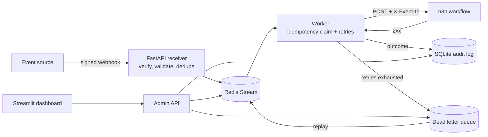

# Event-Triggered Automation Agent

A reliable event processor that receives signed webhooks and runs matching workflows in **n8n**. It processes each event idempotently, retries transient failures with exponential backoff, and moves events that keep failing into a dead letter queue where they can be inspected and replayed.

**n8n runs the workflows. A custom Python core guarantees reliability.**


## Why this exists

Webhook senders redeliver events, downstream services go down, and workflows fail halfway. Without a reliability layer, that means duplicate side effects and silently lost events. This project puts a small, testable layer in front of n8n so that:

- a redelivered event does not run its workflow twice
- a temporary outage is retried instead of dropped
- an event that cannot be processed is kept, explained, and replayable

## Features

- **Signed webhook receiver** with payload validation and constant-time HMAC-SHA256 signature verification
- **Event routing** by event type, handled by an n8n workflow (Webhook, Switch, handlers, Respond to Webhook)
- **Idempotent processing** in two layers: edge deduplication in the API, plus an atomic claim in the worker
- **Retries with exponential backoff and jitter** for transient failures (timeouts, connection errors, 5xx, 408, 429); permanent errors (other 4xx) are not retried
- **Dead letter queue** storing the failure reason, attempt count, last error, and payload, with one-click **replay**
- **Crash recovery**: messages a worker never acknowledged are reclaimed by another worker
- **Live dashboard** with received, processed, retry, duplicate, pending, and dead-lettered counts, recent events, and the dead letter queue
- **Audit log** in SQLite, since Redis streams get trimmed
- **Automated tests** for signatures, idempotency, retries, and the dead letter flow

## Architecture



**Life of an event**

1. The sender POSTs a JSON event with an `X-Signature` header. The API verifies the signature, validates the payload, and drops duplicates.
2. Accepted events are appended to a Redis Stream.
3. A worker reads the event and atomically claims its ID. If the ID is already done, the event is acknowledged as a duplicate.
4. The worker POSTs the event to the n8n webhook, sending the event ID in an `X-Event-Id` header.
5. On success the ID is marked done. On a transient failure the worker retries with backoff. When attempts run out, the event goes to the dead letter queue and its claim is released so a replay can run again.

### n8n workflow

`Webhook` -> `Prepare Event` -> `Simulate Failure?` -> `Route by Type` -> handler nodes -> `Respond 200`

The `Simulate Failure?` branch returns HTTP 500 on request, which makes it easy to demonstrate retries and the dead letter queue.


## Tech stack

All free and open source.

| Layer | Tool |
|---|---|
| Webhook receiver | FastAPI, Uvicorn |
| Validation and config | Pydantic v2, pydantic-settings |
| Signature verification | `hmac` and `hashlib` (standard library) |
| Event bus | Redis Streams with consumer groups |
| Idempotency | Redis `SET NX EX` |
| Worker | Python asyncio, `redis-py` |
| Retries | tenacity |
| Workflow engine | n8n (self-hosted Community Edition) |
| HTTP client | httpx |
| Audit log | SQLite |
| Dashboard | Streamlit |
| Testing | pytest, pytest-asyncio, fakeredis |
| Packaging | Docker Compose |

## Getting started

### Prerequisites

- Docker Desktop
- Python 3.11 or newer (only for the test script and the tests)

### 1. Clone and configure

```bash
git clone https://github.com/mehak2710/event-automation-agent.git
cd event-automation-agent
```

Create your config file and change the two secrets inside it.

```bash
# Windows
copy .env.example .env

# macOS / Linux
cp .env.example .env
```

### 2. Start the stack

```bash
docker compose up -d --build
docker compose ps
```


### 3. Set up n8n (one time)

1. Open http://localhost:5678 and create your local owner account.
2. Go to **Workflows > Import from file** and choose `n8n/workflows/event_router.json`.
3. Click **Publish**. The worker calls the production webhook URL, so the workflow must be published.

### 4. Open the services

| Service | URL |
|---|---|
| Dashboard | http://localhost:8501 |
| API docs | http://localhost:8000/docs |
| Health check | http://localhost:8000/health |
| n8n | http://localhost:5678 |

### 5. Send test events

Create a local environment for the test script:

```bash
python -m venv .venv

# Windows
.venv\Scripts\activate
# macOS / Linux
source .venv/bin/activate

pip install -r requirements-dev.txt
```

Then send signed events and watch the dashboard update:

```bash
python -m scripts.send_test_event                          # normal event, succeeds
python -m scripts.send_test_event --type user.signup       # a different route
python -m scripts.send_test_event --id evt_dup --repeat 3  # first queued, the rest blocked
python -m scripts.send_test_event --fail                   # n8n returns 500, retries, dead letter queue
python -m scripts.send_test_event --bad-signature          # rejected with 401
```

To follow the worker live: `docker compose logs -f worker`.

### Recovery demo: retry, dead letter, successful replay

```bash
docker compose stop n8n                 # simulate n8n being down
python -m scripts.send_test_event       # retries run out, event lands in the dead letter queue
docker compose start n8n                # wait about 30 seconds for n8n to boot
```

Then click **Replay** on the event in the dashboard. It turns into a `succeeded` row. (Replaying the `--fail` event fails again, because its payload asks n8n to fail.)

### Run the tests

```bash
python -m pytest
```

### Stop

```bash
docker compose down        # keeps your data
```

Avoid `docker compose down -v`, which also deletes the n8n and Redis volumes.

## Configuration

Set in `.env` (see `.env.example`). Docker Compose overrides the Redis and n8n URLs for the containers.

| Variable | Default | Purpose |
|---|---|---|
| `WEBHOOK_SECRET` | `change-me` | Key used to sign and verify webhooks |
| `ADMIN_TOKEN` | empty | Protects the admin API used by the dashboard |
| `N8N_WEBHOOK_URL` | `http://localhost:5678/webhook/events` | Where the worker sends events |
| `MAX_ATTEMPTS` | `5` | Attempts before an event is dead-lettered |

### Sending your own events

Sign the raw request body with HMAC-SHA256 using `WEBHOOK_SECRET` and send the result as `X-Signature: sha256=<hex digest>`. `scripts/send_test_event.py` shows a working example. The body looks like:

```json
{ "id": "evt_123", "type": "order.created", "data": { "amount": 42 } }
```

### Admin API

Protected by the `X-Admin-Token` header when `ADMIN_TOKEN` is set.

| Endpoint | Purpose |
|---|---|
| `GET /admin/stats` | Counters, stream length, pending, dead letter queue length |
| `GET /admin/events` | Recent audit log rows |
| `GET /admin/dlq` | Dead-lettered events |
| `POST /admin/dlq/{entry_id}/replay` | Replay one event |
| `POST /admin/dlq/replay-all` | Replay everything in the dead letter queue |

## Project structure

```
app/
  api.py             FastAPI: webhook receiver and admin endpoints
  worker.py          Consumer: idempotency claim, execute with retries, ack or dead letter
  streams.py         Redis Stream helpers (enqueue, read, reclaim, ack)
  idempotency.py     Atomic claim / complete / release of event IDs
  retry.py           tenacity policy, transient vs permanent errors
  dlq.py             Dead letter stream: send, list, replay
  executor.py        Calls the n8n webhook
  router.py          Event type to executor mapping
  security.py        HMAC signing and verification
  schemas.py         Event model
  audit.py           SQLite audit log
  config.py          Settings
dashboard/
  streamlit_app.py   Live dashboard
n8n/workflows/
  event_router.json  Importable n8n workflow
scripts/
  send_test_event.py Signed test event sender
tests/               pytest suite
docker-compose.yml   redis, n8n, api, worker, dashboard
```

## Future enhancements

- Replace the placeholder handlers with real n8n integrations (Slack message, Google Sheets row, email)
- Add a queue listener as a second input next to webhooks
- Show n8n execution status on the dashboard using the n8n API
- Verify the experimental Groq route for `ai.*` events end to end (set `GROQ_MODEL` to a current model, since Groq retired `llama-3.1-8b-instant` in August 2026)
- Add Prometheus metrics and alerting on dead letter queue growth
- Add per-event-type retry policies and a maximum age for queued events
- Support multiple webhook secrets so each source can be signed independently

## Author

Built by [Mehak](https://github.com/mehak2710).
